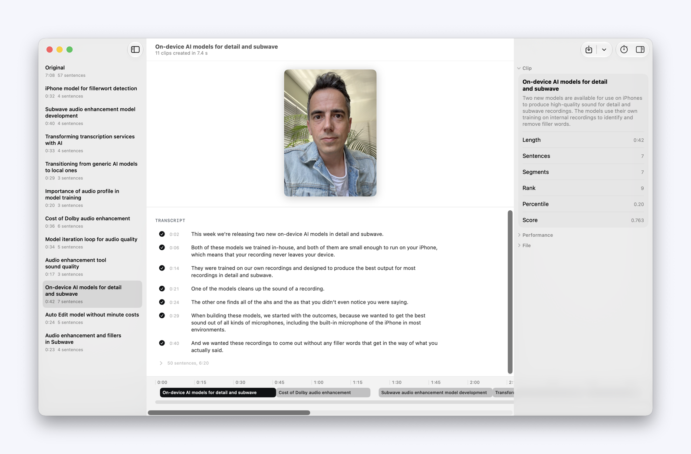

# Clipper

Generate short clips from a video podcast, meeting recording, or longer
recording, fully on device. A local macOS app and a command-line tool over the
same core.



## Download

Homebrew is the one to use, because `brew upgrade` moves you to the next
release:

```bash
brew tap desert-ant-labs/tap
brew install --cask clipper
```

Homebrew 6 asks you to approve a tap it has not seen before. Answering that
prompt covers Clipper, and `brew trust desert-ant-labs/tap` covers anything
Desert Ant publishes later.

Or download the [disk image](https://github.com/Desert-Ant-Labs/demo-clipper/releases/latest/download/Clipper-1.0.dmg)
and drag Clipper to Applications. Clipper works on macOS 26 or later on Apple
Silicon.

The three models come off Hugging Face on first run and are cached for every
run after: Voz is 466MB, Title 280MB, Clips 275MB. Nothing is uploaded and
nothing needs an account.

Clipper reads the latest release tag at launch and says nothing unless there is
a newer one. Check for Updates in the Clipper menu runs the same check and
always answers. Nothing installs itself.

```
video ──► audio ──► Voz ──► sentences ──► Clips ──► Title ──► AVFoundation ──► mp4
```

[Voz](https://desertant.com/models/voz/) transcribes the audio with a time on
every word. [Clips](https://desertant.com/models/clips/) scores the sentences
and returns the best spans, ranked. [Title](https://desertant.com/models/title/)
writes a title and a description for each one. AVFoundation cuts the source to
the picked ranges, so you export finished mp4s and post them.

## Run it

The tasks run through [mise](https://mise.jdx.dev) (`brew install mise`), which
pins xcodegen.

```bash
git clone https://github.com/Desert-Ant-Labs/demo-clipper.git
cd demo-clipper
mise trust && mise install
mise run run       # build Release and open the app
```

The three models come off the Hub on first use and are cached, so nothing has
to be installed first. `mise run models` fetches them ahead of that run, which
is worth doing before a demo: Title alone is 280MB.

Drop a video on the window, open one with the toolbar button, or pass one to
the app: `open -a Clipper my-talk.mp4`. Pick a clip to preview the cut, then
export that clip or all of them.

The other tasks are `build`, `cli`, `test`, `xcode` (generate and open the
project), and `clean`.

## The command line tool

```bash
mise run cli
build/Build/Products/Release/clipper my-talk.mp4 --out ./clips
```

| flag | what it does |
|---|---|
| `--out <dir>` | where to write the mp4s (default: working directory) |
| `--count <n>` | keep only this many of the ranked clips (default: all of them) |
| `--from-transcript <file>` | clip a JSON transcript instead of a video |
| `--clips-model <dir>` | read the Clips model from here |
| `--title-model <dir>` | read the card model from here |
| `--voz-model <dir>` | read the Voz model from here |
| `--no-titles` | pick the clips and skip writing them |
| `--dry-run` | find and print clips without exporting |
| `--transcript` | print the timed transcript and stop |
| `--json` | print the result as JSON |

Progress goes to stderr and results to stdout, so `--json` pipes cleanly:

```bash
clipper my-talk.mp4 --dry-run --json | jq -r '.clips[].title'
```

`--from-transcript` runs the models on a transcript alone: no audio, no export.
The file holds a list of sentences, an object with a `sentences` key, or a list
of either, so you can check a run against a reference.

## How it is put together

```
App/Sources/           the SwiftUI app
App/Sources/Clipping/  Speech, Reader, ClipFinder, Pick, Cutting, shared with the CLI
CLI/                   the clipper tool, built by the ClipperCLI target
Tests/                 the suites, over App/Sources/Clipping
project.yml            xcodegen. Clipper.xcodeproj is generated and gitignored
```

The app, the CLI and the tests compile one shared set of sources.
`App/Sources/Clipping` holds everything that is neither SwiftUI nor argument
parsing.

The core makes the clip decisions. `Sentence` splits the words, `Clips` chooses
the moments, `Clip.ranges` gives the spans, and `Titles` writes the cards. The
SDK's work starts at timed words and stops at clips and time spans, so reading
the audio and cutting the file are this app's. Replace `Speech.swift` and
`Cutting.swift` if you bring your own recognizer or your own editor.

`mise run models` installs all three under `~/Library/Application
Support/Clipper/Models`, and `CLIPPER_CLIPS_MODEL`, `CLIPPER_TITLE_MODEL` and
`CLIPPER_VOZ_MODEL` point somewhere else. A model with no directory of its own
resolves through the SDK's managed cache in `~/Library/Caches/desert-ant-models`,
which downloads the revision the SDK is pinned to.

## Requirements

macOS 26 or later on Apple Silicon, and Xcode 27. MLX has no x86_64 backend and
Voz's Core ML buffers are `Float16`, so the `mise` tasks pass `ARCHS=arm64`.
Building from Xcode's UI needs the same.

Both packages resolve from their released tags:
[`desert-ant-core`](https://github.com/Desert-Ant-Labs/desert-ant-core) for the
models, [`desert-ant-swift`](https://github.com/Desert-Ant-Labs/desert-ant-swift)
for the brand kit. `Packages/MLXTrait` is a local manifest that enables the
core's `MLX` trait, which an Xcode project cannot declare on its own.

To sign with your own certificate, run `mise set --file mise.local.toml
CLIPPER_TEAM_ID=XXXXXXXXXX`. Left alone, a build is signed to this machine.

## License

Clipper's source is MIT. See [`LICENSE`](LICENSE).

The models are licensed separately, under the [Desert Ant Labs Source-Available
License 1.0](https://license.desertant.com/1.0). You can ship them free below
100,000 monthly active devices per platform for each model, you credit Desert
Ant Labs, and you may not train a competing on-device model from the models,
their outputs, or their logs. Attribution guidance at
<https://license.desertant.com/attribution>, commercial licensing at
<licensing@desertant.com>.

The `desert-ant-swift` brand kit is MIT; the Desert Ant name and mark stay
trademarks. Everything that ships is listed in
[`THIRD_PARTY_NOTICES.md`](THIRD_PARTY_NOTICES.md).
